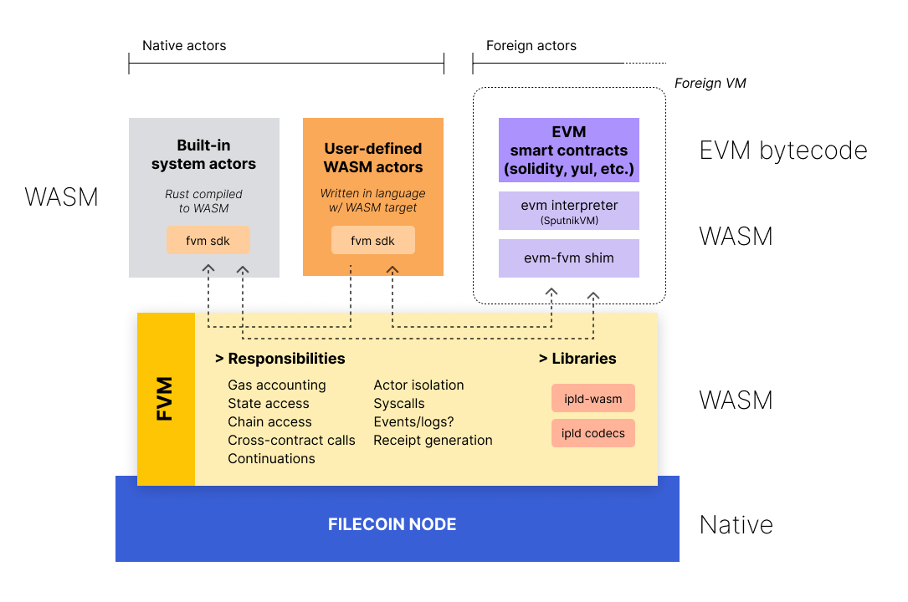
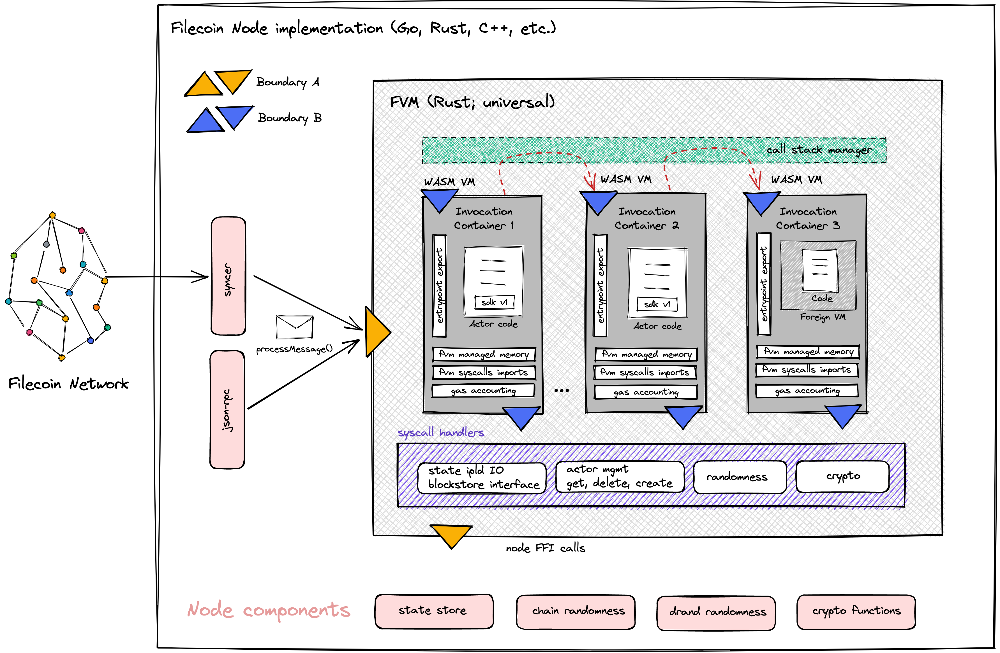
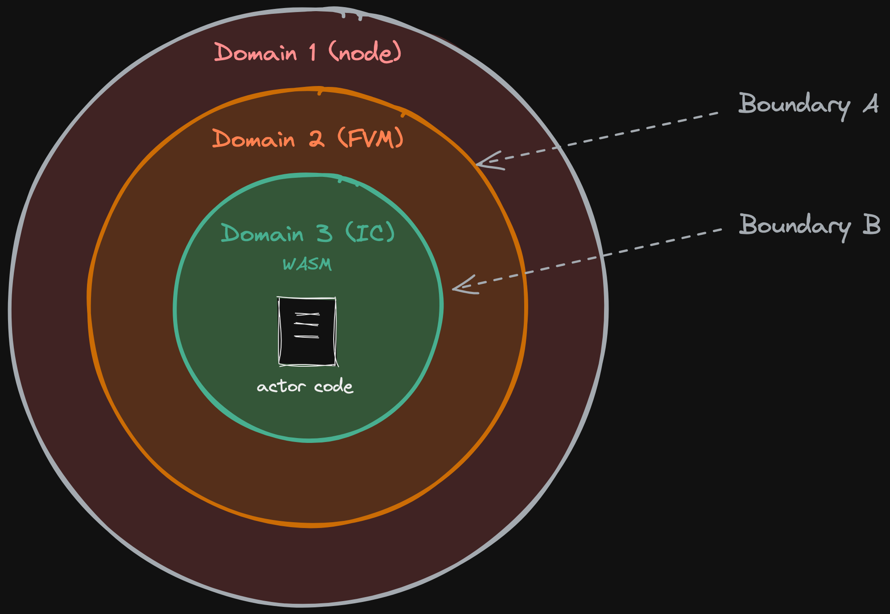
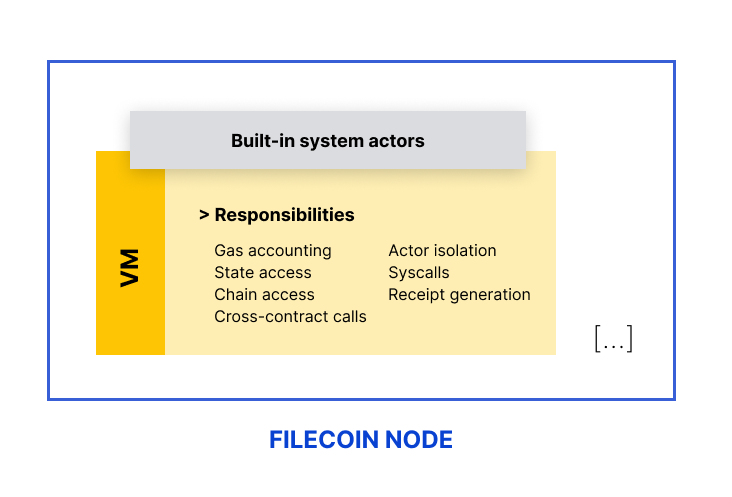

# Use Cases

Potential use cases for user-generated Filecoin actors in the Filecoin Virtual Machine (FVM), suggested by the ecosystem.

**Contents**

<!-- START doctoc generated TOC please keep comment here to allow auto update -->
<!-- DON'T EDIT THIS SECTION, INSTEAD RE-RUN doctoc TO UPDATE -->


- [Multi-generational storage](#multi-generational-storage)

<!-- END doctoc generated TOC please keep comment here to allow auto update -->

## Multi-generational storage

Suggested by Alex Fox - Neonix <alex.fox@neonix.io>

In the 1960's, the British Broadcasting Company (BBC), erased master copies of episodes of the popular television series Doctor Who. In the blink of an eye, this culturally significant data was lost to history. This story is repeated countless times -- no matter if the data is held by an individual, an organization, or a government. How can we guarantee reliable archival storage over periods of hundreds to thousands of years, or beyond?

What if we could outsource responsibility of storing and maintaining humanity's most important data to professional Storage Providers (SPs) who are continuously incentivized to persist the data on reliable storage mediums.

With a smart contract, we could lock a FIL balance as a bounty. The bounty is distributed over time to multiple Storage Providers (SPs) who prove that they have a copy of the data. New SPs can begin to claim a share of the bounty at any time. The deflationary nature of the FIL token should ensure that the bounty remains lucrative in future.

raulk (Filecoin Slack): "I would imagine that storage providers would claim portions of the bounty by presenting the sector ID and a merkle proof that traces the commP (deal data) to the commR of the sector. The contract would then call the miner actor to verify that the sector is alive, healthy and is being consistently proven."

# Analysis of the state-of-the-art

> _As of Fall 2021._

This document enumerates other WASM-related resources that are relevant to FVM, and analyzes them from the viewpoint of prior art.

## WASM resources

- Wasmer.io
- eWASM

### [eWASM](https://ewasm.readthedocs.io/en/mkdocs/)

Some interesting considerations for Blockchain VMs. Work seems to have stalled in 2019.

- [WASM syscall interface](https://github.com/ewasm/ewasm-rust-api/blob/master/src/lib.rs)

## WASM-based VMs in other blockchains

- [NEAR](https://docs.near.org/docs/develop/contracts/overview), including [Aurora](https://github.com/aurora-is-near/aurora-engine) (EVM for NEAR)
- Polkadot/Substrate
- [CosmWasm](https://cosmwasm.com/) (Cosmos)
- [SVM](https://spacemesh.io/blog/spacemesh-virtual-machine-svm/) (Spacemesh)
- [Arwen VM](https://docs.elrond.com/technology/the-arwen-wasm-vm/) (Elrond)
- [Aqua VM](https://doc.fluence.dev/docs/concepts) (Fluence)
- [Mokoto](https://dfinity.org/faq/why-does-motoko-compile-to-webassembly/) (Dfinity)
- [ETH2 execution environments/engines](https://ethresear.ch/t/eth-execution-environment-proposal/5507) -- appears stangant.
- \<more>

### [Substrate](https://substrate.dev/docs/en/knowledgebase/smart-contracts/contracts-pallet)

Supports WASM and the EVM, but with separate VMs. It also supports cross-VM calling.

### [NEAR](https://github.com/near)

WASM based VM, but they're adding EVM support with [project Aurora](https://github.com/aurora-is-near/aurora-engine/).

Has an async (and parallel?) calling convention. [Calling](https://docs.near.org/docs/tutorials/contracts/cross-contract-calls) is entirely based on callbacks and promises. Of course, it does all this without closures so it's more like erlang than javascript.

- [WASM syscall interface](https://github.com/near/near-sdk-rs/blob/master/sys/src/lib.rs)

# Introduction

The existing Virtual Machine (VM) in the Filecoin system acts as the execution environment for code deployed on-chain in the form of _Actors_. Actors are the Filecoin-equivalent of what the industry calls _"smart contracts"_.

Today's system revolves around a predefined set of [built-in system actors](https://spec.filecoin.io/#section-systems.filecoin_vm.sysactors). Collectively, these actors implement Filecoin-specific behaviour, such as storage provider management, sector tracking, protocol rewards, power accounting, storage markets, etc.

There's just one problem: users are unable install and run new _actor_ types. This results in Filecoin lacking general programmability.

This repo contains research and design material for the FVM: a revision of the VM subsystem of the Filecoin network in order to enable the deployment of user-defined actors to the Filecoin network.

# Filecoin implementations

For the purposes of this document, we consider four Filecoin node implementations:

1. [Lotus](https://github.com/filecoin-project/lotus) (written in Go; reference implementation), own actors implementation.
2. [Forest](https://github.com/ChainSafe/forest) (written in Rust), own actors implementation.
3. [Venus](https://github.com/filecoin-project/venus) (written in Go; former go-filecoin implementation), reuses Lotus actors via go import.
4. [Fuhon](https://github.com/filecoin-project/cpp-filecoin) (written in C++), reuses Lotus actors via FFI.

# Motivations

1. **Proliferation of innovative solutions in user space.** Giving users the ability to program new behaviours on top of the existing Filecoin primitives will unlock degrees of freedom, potential for innovation, and composability/stacking of primitives to form innovative solutions in a DeFi fashion.
2. **Lower dependence on system actor evolution.** Features that would otherwise require changes to system actors could now be implemented in a trustless manner in user space.
3. **Unlocking layer 2 solutions.** Currently layer 2 solutions can only exist as sidechains, but it's impossible to create 
5. **Universally executable spec / "Code is Law".** A single version of system actors running in a deterministic environment enables all clients to univocally arrive to consensus. (Counterpoint: This also poses some risks)
6. **Quicker protocol evolution.** Protocol upgrades can be implemented once. Rollout of FIPs will no longer bottleneck on finishing implementation across clients. Less coordination needed across implementers.
7. **Basis for computation-over-data.** There's good reason to believe that IPLD-ready WASM-based VMs are a useful stepping stone to enable computations
8. **Enabling governance-driven automatic protocol upgrades**. As more elements of the Filecoin protocol migrate to WASM space (e.g. block validation, fork choice rule, etc.), it becomes possible to deploy protocol changes as WASM modules to all clients, conditional upon on-chain voting.

# Requirements

1. Must support multiple VM runtimes, making it possible to deploy EVM bytecode (contracts likely written in Solidity) with full execution parity in 95% of cases, as well as contracts written natively and specifically for Filecoin.
2. Must enable interfacing seamlessly with built-in system actors.
3. Must support calls across contracts targeting different VM runtimes.
4. Must support synchronous calls, and should eventually support asynchronous calls.
6. Must be IPLD-native, handling all IPLD access patterns efficiently.
7. Must track reachability of IPLD objects upon state mutations to prevent indiscriminate state growth.
8. Must account for real computation costs (high-fidelity gas metering).
9. User code must not prevent system messages from executing (TBD).
10. Should support formalising interface contracts (methods, arguments, return values) with IPLD schemas.
11. Must be simple, approachable, and enjoyable to program for.

# Risks

1. **State size.** Without rent/expiration, gas will need to be carefully tuned to avoid a further explosion of state size. Furthermore, consideration will have to be taken for state expiration (or we'll have to design for it up-front?.
2. **Chain bandwidth.** Without sharding, we'll likely need to implement multiple "lanes" (as we've discussed before) to ensure that user actors don't clog necessary traffic like deal making.
3. **Performance degradation.** If we compile our actors to WASM, execution time could increase.# Filecoin VM architecture

> v0, early October 2021
> Authors: @raulk, @stebalien.
> Contributors: @expede, @aronchick, @bmann

This documents provides an overview of the architecture of the FVM, including a small summary of the current VM as an annex at the end.

<!-- START doctoc generated TOC please keep comment here to allow auto update -->
<!-- DON'T EDIT THIS SECTION, INSTEAD RE-RUN doctoc TO UPDATE -->
**Table of Contents**  *generated with [DocToc](https://github.com/thlorenz/doctoc)*

- [Overview](#overview)
  - [Native user-defined actors](#native-user-defined-actors)
  - [Foreign user-defined actors](#foreign-user-defined-actors)
  - [Built-in system actors](#built-in-system-actors)
- [Execution architecture](#execution-architecture)
  - [FVM](#fvm)
  - [Invocation Container (IC)](#invocation-container-ic)
  - [Domains and boundaries](#domains-and-boundaries)
  - [FVM syscalls](#fvm-syscalls)
  - [FVM SDK](#fvm-sdk)
- [Actor public interface](#actor-public-interface)
- [IPLD everything](#ipld-everything)
- [State access](#state-access)
- [Actor deployment](#actor-deployment)
- [Call patterns](#call-patterns)
- [Gas accounting](#gas-accounting)
- [Actor code updates](#actor-code-updates)
- [JSON-RPC API](#json-rpc-api)
- [Interoperability with other networks](#interoperability-with-other-networks)
- [Formal verifiability](#formal-verifiability)
- [Annex: Current VM](#annex-current-vm)

<!-- END doctoc generated TOC please keep comment here to allow auto update -->


## Overview



The FVM aims to (a) support a multitude of programming models for actors and (b) facilitate the onboarding of smart contracts and programs written for other environments, so they can leverage the storage capabilities of the Filecoin network.

The architecture is largerly inspired by [VM hypervisors](https://en.wikipedia.org/wiki/Hypervisor) and the [actor model](https://en.wikipedia.org/wiki/Actor_model), amongst others paradigms.

## Actors

The term _Actor_ is a reference to the [actor model](https://en.wikipedia.org/wiki/Actor_model), a concurrent computation paradigm that inspires Filecoin's runtime and scalability primitives.

We distinguish three types of actors:

1. Native user-defined actors: targeting the FVM at development time.
2. Foreign user-defined actors: originally targeting another runtime (e.g. EVM) at development time. Likely named "smart contracts" in their original context.
3. Built-in system actors: existing as of today.

### Native user-defined actors

The native FVM runtime is WebAssembly (WASM), and users can technically write actors in any programming that compiles to WASM.

However, there are language-specific overheads that users need to be aware of (e.g. runtime, garbage collection, stdlibs, etc.) They affect the WASM output leading to bloated WASM bytecode and inefficient execution. There will be on-chain code size limits to consider too.

Rust is our primary language recommendation for writing efficient user-defined actors. Hence, the reference FVM SDK is built in Rust.

Exploration of other languages is something we encourage the community to pursue.

### Foreign user-defined actors

The platform-agnostic, hypervisor-inspired architecture of the FVM makes it possible to deploy code targeting foreign runtimes.

Our initial priority is the EVM: we aim to support deploying EVM bytecode as-is to the Filecoin network. We will adopt [SputnikVM](https://github.com/rust-blockchain/evm), a Rust EVM interpreter compatible with WASM runtimes, and will shim the Ethereum network specific behaviours to Filecoin counterparts.

Admittedly, this is an inefficient solution in terms of performance, but it allows for straightforward and relatively risk-free deployment of existing battle-tested Ethereum smart contracts to the Filecoin network.

The gas accounting will factor in the inefficiency, resulting in more expensive executions. This will incentivise developers to migrate the smart contracts to native FVM actors to attain lower execution costs.

In addition to the EVM, in the future we are keen to support for Agoric SES, Solana's BPF, and other blockchain programming models and paradigms.

We believe that compatibility should be accomplished by translating/emulating the lowest-possible executable output in its source form, rather than dealing with high-level languages using alternative/custom toolchains.

Moreover, this choice enables developers to (re-)use all the tooling available in the source ecosystems, and results in the highest possible execution fidelity/parity, thus reducing technical risks.

Refer to [foreign runtimes](#foreign-runtimes) for more detail.

### Built-in system actors

Built-in system actors will run entirely in WASM space. Their source could will migrate to using the FVM SDK. They will be compiled to WASM, and will ship as static WASM modules bundled in the Filecoin node implementation distributions, probably via in-binary embedding.

System actors will continue to (1) be statically bound to their existing addresses, and (2) evolve through system upgrades. Opportunities for network-directed upgrade mechanisms are in the roadmap.

Note: this plan is dependent on the results from preliminary performance benchmarking of WASM vs. native system actors. If the former underperform by an unacceptable margin, we might be compelled to keep the system actors in native space, and treat them like "precompiled contracts" in other platforms.

**Canonical system actors**

This transition to WASM opens up the opportunity to converge on a single codebase of actors for all Filecoin implementations.

In the past, each team would re-implement actors in their language (although some relied on FFI with Go actors, a slower approach). With FVM, a single codebase can be compiled to WASM (its new portable executable form) and be adopted across all implementations.

We acknowledge this strategy has tradeoffs, but we won't elaborate on them here.

## Execution architecture



### FVM

The FVM is implemented in Rust. It is responsible for:

1. Setting up Invocation Containers, managing their lifetime and stacking. This include setting up the WASM runtime, its managed memory, binding syscalls as host-provided functions, and potentially mapping dynamically-linked libraries (e.g. predefined sdk versions).
2. Serving as a call orchestration layer across actors.
3. Resolving Boundary B syscalls where possible within the FVM.
4. Relaying Boundary B syscalls to Boundary A syscalls where the above is unfeasible.
5. Managing IPLD state tree data, by buffering writes from actors running in ICs until execution succeeds, maintaining caches, optimising access patterns (e.g. optimistic fetches), and more.

### Invocation Container (IC)

The Invocation Container (IC) is the tightly constrained and instrumented environment that runs actor code within the context of a single invocation, in isolation with the rest of the system.

The IC is an instance of a WASM runtime (likely Wasmer) fulfilling the FVM contract. The contract consists of:

1. FVM-defined syscalls available as imported functions.
2. FVM-managed memory. Only statically-sized data such as message CID, epoch, gas limit, due to technical limitations (need to investigate more).
3. Gas accounting and execution halting via WASM bytecode compiler weaving and/or instrumentation.
4. Dynamically-linked "blessed" imported WASM modules (e.g. named FVM SDK versions) to reduce bytecode size.

A direct or indirect recursive or reentrant call to an actor spawns a new IC.

Because the FVM contract may change over time, user-deployed actors must specify an IC version at [`InitActor#LoadActor` time](#actor-deployment).

### Domains and boundaries

There are three logical domains of execution we are concerned with for the purposes of this design doc:

- Domain 1: Node (any language).
- Domain 2: FVM (reference implementation written in Rust).
- Domain 3: Invocation Container running actor code (WASM).

These three domains result in two well-defined domain boundaries that possess different characteristics. We'll call them Boundary A and Boundary B.



**Boundary A: Node \[domain 1] <> FVM \[domain 2]**

This boundary is incurred when:

1. the node initiates the processing of a message by instantiating the FVM, or
2. the FVM calls out to native functions provided by the node to resolve syscalls.

Depending on node's language, this boundary may carry a non-negligible cost. Although admittedly, that cost may be overshadowed by the cost of the operation itself (e.g. if it involves disk IO, or an expensive cryptographic calculation).

Where performance is important, implementors should attempt to resolve most syscalls within domain 2, to avoid traversing Boundary A in order to avoid "death by a thousand cuts"-like performance leaks.

_Lotus opportunity:_ cryptograhic functions related to signatures, proving systems (PoSt, PoRep) and more are implemented in [rust](https://github.com/filecoin-project/rust-fil-proofs), and invoked through the [Filecoin FFI](https://github.com/filecoin-project/filecoin-ffi).

**Boundary B: FVM \[domain 2] <> Invocation Container (WASM) \[domain 3]**

This boundary is incurred every time actor code invokes a syscall. The syscall is first handled by the FVM, which in turn may need to traverse Boundary A to resolve it.

Because the reference implementation of the FVM is written in Rust, and the WASM <> Rust FFI mechanisms are relatively cheap, the cost of this boundary is lower than Boundary A (in the reference implementation).

*Opportunity rust-fil-proofs.* [rust-fil-proofs](https://github.com/filecoin-project/rust-fil-proofs) implements the Filecoin proofs (PoRep, PoSt) and related cryptographic primitives in Rust, for performance reasons. The library is integrated in Lotus via Cgo in is the implementation of the Filecoin storage proofs implemented in Rust for performance rasons. in  is integrated into non-Rust clients via FFI. 

### FVM syscalls

Pre-FVM, the term "syscalls" referred to a predetermined set of cryptographic functions available to built-in system actors, each with an associated gas cost.

- BatchVerifySeals
- ComputeUnsealedSectorCID
- HashBlake2b
- VerifyAggregateSeals
- VerifyConsensusFault
- VerifyPoSt
- VerifySeal
- VerifySignature

Post-FVM, the term "syscall" matches the Unix concept more closely. It represents the fundamental interface between any two execution areas. As such, there are syscalls at both boundaries:

- Boundary A syscall: the fundamental interface between the FVM and the node.
- Boundary B syscall: the fundamental interface between the actor and the FVM.

Examples of post-FVM syscalls are:

- `CurrEpoch()`
- `NetworkVersion()`
- `CurrentBalance()`
- `ResolveAddress()`
- `GetActorCodeCID()`
- `GetRandomessFromBeacon()`
- `GetRandomnessFromTickets()`
- `Send()`
- IPLD state operations (read, write, open, close)
- all the above crypto operations.

Essentially, all methods listed on the current specs-actors [`Runtime` interface](https://github.com/filecoin-project/specs-actors/blob/master/actors/runtime/runtime.go) translate into syscalls.

However, frugality is also a concern. There are opportunities to elide the actual syscall by, for example, mapping static fields as externally-managed WASM memory (e.g. current epoch, network version), or to avoid Boundary A syscalls through caching, optimistic optimisations, or providing the behaviour within the FVM domain.

### FVM SDK

The FVM SDK is a versioned library that makes it easy to write actors for the Filecoin Network. At its core, the SDK is aware of the FVM contract and facilitates interaction of actor code with its environment.

The reference implementation of the FVM SDK is written in Rust.

We envision the SDK to be a stack of our layers, from lowest to highest:

1. Syscall definitions/bindings. These are considered plumbing; most developers won't interact with these, but they're necessary to invoke syscalls.
2. Thin syscall wrappers. These are less horrible counterparts to the low-level syscall bindings that use higher-order types.
3. Higher-level APIs offering elemental abstractions and components, such as the blockstore, IPLD interfaces, internal method dispatch, parameter and call convention packing/unpacking, etc.
4. Libraries on top of the latter that implement IPLD-based data structures, such as ADLs, HAMTs, struct binding to params, annotation-based method dispatch, cross-actor call templating, etc.

Together, (1) and (2) form the basis of the **FVM stdlib**.

We recognise that some libraries within layer (4) may be inefficient to execute in WASM land (such as BigInt arithmetic). We may deal with this by escaping the WASM runtime and translating such operations to syscalls that run in the FVM domain. However, gas accounting becomes difficult in such cases, as we'd have to pollute the gas schedule with specific operations.

We could also add the ability to deploy libraries as on-chain actors; this would lead to a richer development experience and we'd expect collections of reusable libraries to emerge and be deployed on-chain, for others to consume. This is similar to the use cases of the `CALLDELEGATE` opcode in the EVM. But we'd probably tighten the security characteristics by introducing the notion of "capabilities", such that the calling actor can specify exactly what the target can access.

## Actor public interface

We considered two main approaches. Hybrids of these two approaches were also evaluated.

**Approach 1 is external method dispatch.** The actor exports a table of callable methods. The sandbox matches the message to an exported method, either through the `MethodNum` message field, or by interpreting the input parameters string against a calling convention. This is largely how the current VM works today.

**Approach 2 is for actors to expose a single entrypoint and rely on internal method dispatch.** This awards maximal degrees of freedom and sophistication to support techniques such as structural pattern matching, efficient pass-through proxying, interception, and more.

Because internal dispatch will rapidly become boilerplate, the FVM SDK should offer utilities.

Architecturally speaking, Approach 2 is more aligned with the actor model as implemented in the industry (Erlang, Akka, etc.), in which actors interact through single inboxes where messages are deposited.

Approach 2 is simpler, and places no constraints on the sandbox. It is easier to reason about and reduces overall complexity. It's also more performant because the sandbox has no need to analyse the WASM exports table. Evolving actors over time (such as introducing interface changes) is also easier to reason about.

Finally, this approach is readily compatible with VMs that rely on internal dispatch (e.g. EVM), but also stretches to accommodates for VMs that perform outer dispatch.

Approach 2 would render the `MethodNum` field on messages obsolete, as external dispatch is no longer necessary, and all call information would be contained in the input parameters.

We _could_ technically preserve the `MethodNum`, and have actors perform internal dispatch based on that _and_ input parameters. But we believe that's unnecessary cruft, and it breaks the actor-orientation paradigm by carrying over a procedural construct.

Not everything is rosy, though. The main risk with Approach 2 is that the calling convention not explicited, which may lead to proliferation of calling conventions across user-deployed actors. In turn this may result in cognitive overhead and interoperability issues.

An IPLD-based Interface Definition Language should eliminate that concern. 

**Future: IPLD-based IDLs**

IPLD Schemas are good for defining the structure of objects, but they do not help with expressing the interface of behaviours an object can offer (e.g. methods), inputs, and outputs.

Our basic idea is to design an IPLD schema for IDLs; think of [gRPC IDLs](https://grpc.io/docs/what-is-grpc/core-concepts/), [SOAP WSDL](https://www.w3schools.com/xml/xml_wsdl.asp), etc. This schema would be standardised and versioned, and understood by the FVM SDK.

This IDL would not have functions as such, but rather _labelled behaviours_. This is consistent with the actor model, where actors don't expose functions, but they are known to provide behaviours.

Each behaviour would carry an IPLD Schema for the input type and the return value type, an error code enum, and potentially an identifier (which incidentally could be a method number!) to facilitate internal dispatch.

Traditional "overloaded functions" can be represented as distinct labelled behaviours dispatching to the same identifier.

The FVM SDK would offer utilities to pack/generate calls to another actor with their IDL.

_Pseudocode:_

```
import "idls/other-actor.idl.ipld" as actor
from sdk import calls

// Res is typed automatically as Result<Type, Error>
let res = calls.target(actor)
               .call("behaviour")
               .with({ Field2: Value, Field2: [Value1, Value2]})
```

**Test sandbox**

The FVM project will need to ship a test actor sandbox for developers to use during their actor development process.

**Foreign runtimes**

Support for foreign runtimes, such as the EVM, will be introduced by emulating those runtimes over WASM by compiling the respective interpreter to WASM bytecode.

We expect a performance penalty from doing this (the extent of it is to be determined), but this tradeoff is workable in exchange for the highest execution fidelity/parity.

Note that adopting more performant alternatives imply compiling the respective high-level languages (e.g. Solidity) to WASM, which bears additional risks that are undesirable. Doing so would also render usesless tools that operate on their native target bytecode (e.g. auditing tools that analyse EVM bytecode, EVM bytecode inspectors, etc.) Thus we prefer to adopt an approach that allows usage of the full catalogue of preexisting tools to be preserved.

Each foreign runtime will require a shim to translate the storage model, gas accounting, account/address schema, gas metering, cross-actor calls, etc. to the native FVM runtime. The shim will also handle foreign chain/VM constructs by intercepting them and adapting them to the FVM native runtime.

This is the case of logs/events in the EVM, which may be stored in a central EVM logs actor.

## IPLD everything

IPLD stands for Interplanetary Linked Data, "Linked" being the operative word. Filecoin data is highly atomized and linked. As a result, the state of an actor is not contained in a single blob, but it's broken up into many items all of which are linked together through IPLD data structures.

Structs are common data structures, but some ADLs (advanced data layouts) are also widely used. Concretely, HAMTs (hash array mapped tries; hashtables) and AMTs (array mapped trie; arrays) are very prevalent, as well as higher order compositions of those.

All consensus-dependent data in the Filecoin network is IPLD data, encoded using IPLD codecs. This includes the state tree, state of actors, and chain data. Currently, DAG-CBOR is the codec used for everything, with the exception of PieceCIDs, which are special-cased and not traversable.

Essentially, actors can be construed as logic that receives an input IPLD graph, performs computation, and emits an output IPLD graph (and a return status). IPLD is a is an vital piece in the picture.

With the FVM, we will begin storing code as well, concretely WASM bytecode and EVM bytecode. Code will be stored as IPLD data, and the concrete format/layout is pending definition.

Thus, dealing with IPLD data efficiently must be a priority in the the design of the runtime and the SDK. A ipld-wasm library will be written to group all IPLD functions and expose them to the actor code.

_A word about IPLD codecs_

With regards to codecs, special attention needs to be paid to their scope of execution and their gas accounting: do they pay gas as if normal code, or are they "free" to the caller? Do they execute inside the IC, or in FVM space?

Depending on what we settle, we may designate a set of "blessed" system codecs which are exempted from paying gas.

## State access

Efficient state access is a major concern, and has the potential to become a performance bottleneck. The state store currently lives in the node side, which means that actors need to traverse Boundary A (slow) to access state items.

Because Filecoin IPLD state objects are highly atomized and linked, accessing and mutating entries in objects like HAMTs and AMT (quite prevalent) results in multiple _sequential_ state IO operations, each of which traverses Boundary A in a non-parallelizable way. Boundary A is a slow boundary, and we should measure the performance loss to figure out if it's worth exploring alternative designs, such as migrating ownership of the state store to the FVM such that Boundary A traversals can be prevented.

Another concern is state growth. The Lotus implementation offers a self-pruning store ([splitstore](https://github.com/filecoin-project/lotus/discussions/5788)), but the garbage collection algorithms rely on periodic state tree walking, which will get more expensive as the state tree grows with arbitrary user data.

Therefore, we consider it necessary to invest in native support for garbage collection with techniques such as refcounting.

## Actor deployment

The current InitActor (`f00`) will be extended with a (`LoadActor`) method that takes two input parameters:

1. The actor's WASM bytecode as an input parameter.
2. The IC version (see above).

Logic:

1. Validate the bytecode.
    - Syntactical validation and structural validation, [as per standard](https://webassembly.github.io/spec/core/valid/index.html).
    - No floating point instructions.
2. Multihash the bytecode and calculate the code CID.
3. Check if the code CID is already registered in the `ActorRegistry`.
4. If yes, charge gas for the above operations and return the existing CID.
5. Insert an entry in the `ActorRegistry`, binding the CID with the supplied WASM bytecode.
6. Return the CID, and charge the cost of the above operations, and potentially a price for rent/storage.

At this point, the actor is ready to be instantiated through the standard `Exec` call of the `InitActor`. Any params provided will be passed through to the actor's constructor (method number = 0).

The `InitActor` should be callable from within the FVM itself to enable self-evolving/replicating actors, as well as actor factories.

## Call patterns

The FVM will initially support synchronous calls between actors. Cross-actor calls will incur in Boundary B, and the FVM will incur in Boundary A to load the callee's code and root state.

Callers will need to observe the calling conventions of the callee to ensure the call is understood and processed. The SDK will offer utilities to pack calls according to EVM and standard calling conventions.

In the future, we aim to support asynchronous calls, and we have discussed development patterns like callbacks, continuations, async/await, promises, and others.

This is especially important in a sharded blockchain design, where actor code and state is not available immediately in the caller's chain. Parallel execution must also be supported by the future asynchronous call models.

## Gas accounting

Gas accounting will be performed at the bytecode level, leveraging the metering facilities provided by the WASM runtimes under consideration (Wasmer, Wasmtime).

## Actor code updates

The FVM aims to support updating actor code. This choice diverges from the "code immutability" paradigm that Ethereum made popular. That paradigm is empowering on one hand (the user has the guarantee to always be dealing with the same code), but limiting on the other (software is never static).

The reality is that software evolves continuously driven by feature development, improvements, bug fixing, security patching, and software maintenance (adaptive, corrective, preventive, perfective). Smart contracts _are_ software, and they are not exempted from the need of evolution.

To work around the EVM limitations, Dapp developers have widely adopted the ["upgradable proxy"](https://docs.openzeppelin.com/upgrades-plugins/1.x/proxies)pattern, but this comes at the cost of extra complexity (including `DELEGATECALL` quirks), boilerplate, and yet another point of failure.

In Filecoin, we rely on content-addressed code as a foundational building block to enable code upgradability. Actors have an address, but code is not deployed at that address (like in the EVM); instead it is linked to a CID in the state tree.

This decoupling makes it feasible to atomically update actor code. Doing so would imply:

1. Loading new actor code and obtaining a code CID; see [Actor deployment](#actor-deployment)
2. Calling an `UpdateCode` syscall from within the actor, with the new code CID.

All future messages directed to this actor will use the new code.

Authentication and security behind code updates are entirely in actor space; therefore, actors are free to implement the checks, guards and logic that ultimately lead to the invocation of the `UpdateCode` syscall. Tooling can also be implemented to statically determine that an actor is _not calling_ this function this.

We may consider adding an optional `CodeCID` parameter to messages to enable sensitive senders to condition the execution of a message to a particular actor code version. This may be useful when the sender has performed prior code audit/verification, and wants to limit the execution to the audited version, or to deal with scheduled actor updates.

## JSON-RPC API

Filecoin nodes will begin offering JSON-RPC methods to call actor methods and access actor state.

## Interoperability with other networks

TBD.

## Formal verifiability

TBD.

## Annex: Current VM



Actors operate on the state tree. Nothing else can modify the state tree in normal circumstances, other than actor logic. The single exception is state migration logic during a network upgrades. It can conduct bulk modifications, both to the content and the structure of the state tree.

The state tree is an IPLD object, containing the root of an [HAMT](https://ipld.io/specs/advanced-data-layouts/hamt/spec/#appendix-filecoin-hamt-variant) which in turn contains all actors, keyed by ID address.

Each actor has a type (represented by a CID), and a state root. The VM enforces actor state isolation, thus actors are prevented from accessing each other states.

Message passing is used to communicate between actors, even when simple state accesses are required. Mutations to state may only be applied within transactions.

Actor code is triggered through _messages_. Messages can be:

1. explicit: on-chain messages, leading to a _message receipt_ posted on chain as the result.
2. internal: between actors while processing a chain message, or triggered by a system event such as cron ticking.

Read more about the [structure of messages](https://spec.filecoin.io/#section-systems.filecoin_vm.message.message-syntax-validation).

Messages specify the actor method to invoke. Actors supply a method export table to the environment, and the VM performs method dispatch. This model will be revisited with the FVM, likely moving to actors exposing a single entrypoint, and dispatching internally with the assistance an SDK library.

Actor invocations are entirely synchronous. Actors can register entries in the cron actor, to schedule deferred execution at future epochs. Asynchronous calls are a desire of the upcoming FVM implementation, but not an immediate priority.

# Implementation notes

<!-- START doctoc generated TOC please keep comment here to allow auto update -->
<!-- DON'T EDIT THIS SECTION, INSTEAD RE-RUN doctoc TO UPDATE -->
**Table of Contents**  *generated with [DocToc](https://github.com/thlorenz/doctoc)*

- [VM Considerations](#vm-considerations)
- [WASM](#wasm)
  - [Interpreters](#interpreters)
  - [Floating Point Operations](#floating-point-operations)
  - [32bit or 64bit](#32bit-or-64bit)
  - [Limits](#limits)
- [IPLD Memory Model](#ipld-memory-model)
  - [State Transaction](#state-transaction)
    - [Options 1 & 2](#options-1--2)
    - [Option 3 (selectors)](#option-3-selectors)
  - [Security Considerations](#security-considerations)
- [Global State](#global-state)
- [Calling Convention](#calling-convention)
  - [Sending Data](#sending-data)
  - [EVM Comparison & Tradeoffs](#evm-comparison--tradeoffs)
    - [Method Dispatch](#method-dispatch)
    - [Delegate Call/Call Code](#delegate-callcall-code)
- [EVM Contracts](#evm-contracts)
  - [Multiple VMs](#multiple-vms)
  - [AOT Solidity Compiler](#aot-solidity-compiler)
  - [AOT EVM Transpiler](#aot-evm-transpiler)
  - [EVM Emulation (or JIT)](#evm-emulation-or-jit)
    - [Deploy](#deploy)
    - [JIT](#jit)
- [Gas Accounting](#gas-accounting)
- [Runtime](#runtime)
  - [Static Environment](#static-environment)
  - [Allocation & Variable Sizes](#allocation--variable-sizes)
- [Built-in Actors](#built-in-actors)
  - [Cron](#cron)
- [Resources](#resources)
  - [Tools](#tools)
  - [Rust → WASM](#rust-%E2%86%92-wasm)

<!-- END doctoc generated TOC please keep comment here to allow auto update -->

# VM Considerations

While we've [considered](https://docs.google.com/document/d/1sUl0uxebpY8mDse24a4WBzwVYX0DgDW8mNQD0bbTaqI/edit) alternative VM implementations, we're currently leaning towards WASM. This section dives into VM-related design considerations.

# WASM VM

## Engine / interpreter

Ideally the FVM won't *dictate* which underlying WASM VM must be used. However, we'll need to pick *a* VM implementation.

- Wasmer: Fancy, has a company behind it.
- Wasmtime: More "open", written in rust.
- WasmEdge: Designed for smart contracts.
- Node.js: We could just use node. Not great for embedding.
- gasm: un-optimized interpreter, so probably slower, but golang native

## Floating Point Operations

EWASM forbids floats and the EVM doesn't have them, but in WASM, at least, only *NaN* is non-deterministic. In theory, we could support floats and just normalize results when *NaN*.

**Tentative Decision:** no floats for now, we can add them later if necessary.

- Near is supporting floats: [https://github.com/near/nearcore/issues/1987](https://github.com/near/nearcore/issues/1987)
- EWASM does not.
- Context: [Document why NaN bits are not fully deterministic · Issue #619 · WebAssembly/design](https://github.com/WebAssembly/design/issues/619)

## 32bit or 64bit

The EVM uses 256bit everything, but the EVM is special there.

WASM supports both as separate specs.

**Tentative Decision:** FVM will use 32bit "pointers":

- Better supported.
- Less memory.
- We don't need more than a 4GiB address space on a blockchain (for WASM memory, at least).
- The 32bit VM still supports 64bit integers, just not 64bit memory "pointers".

## Limits

WASM's "[non-determinism](https://github.com/WebAssembly/design/blob/main/Nondeterminism.md)" section is a bit sparse on this.

Importantly, we need to figure out how to measure and limit the stack size this because the stack contains *objects*, it's not just an array of bytes. In addition to numbers, it contains jump labels and frames (which can contain locals, etc.). To avoid having to modify the VM, we'll likely want to instrument branches/calls to check the stack.

# IPLD Memory Model

All state will be stored and retrieved as IPLD. This is important as the VM itself needs to understand the IPLD so we can do garbage collection, etc.

Codecs should ideally be defined as WASM libraries, imported through the WASM import system. Ideally, ADLs and selectors would be implemented in the same way.

Constraints:

1. It must be possible to determine which data is "reachable" by actors, and which isn't. Furthermore, actors must only be allowed to read and/or reference "reachable" data.
2. We'll need a way to reference piece CIDs etc. *without* considering them to be *reachable*.
3. The caller must be charged gas for all work, including any work done by IPLD codecs.

There are three ways to go about this:

1. Hard-code "unreachable" codecs like we currently do. This is, IMO, a non-option.
2. Require that *everything* be reachable, possibly introducing some form of "non-traversable link" kind into IPLD, kind of like a symlink.
3. Use selectors to specify what data is reachable and what isn't.

Out of these options, 3 is likely the most flexible, but it's also hard. We'll likely want to start with a single hard-coded "selector", then upgrade to arbitrary selectors later.

## State Transaction

Below are algorithms for implementing options 1, 2, and 3 as described below. Really, there are two conceptual ways to do this:

1. Let actors access "abstract" IPLD objects, managed by the runtime.
2. Give actors the raw blocks, running any relevant codec code in the actor's context.

I'm focusing on the second approach here because:

1. Language agnostic abstract APIs can be built on-top-of the raw-blocks approach.
2. The "raw blocks" approach gives the actor more flexibility and avoids lots of context switching. The second one is the important part as option 1 would require context switching from the actor, into the runtime, into a codec sandbox, and back for every IPLD *node* operation (e.g., reading a field from an IPLD object).

The main drawback to this approach is security: the codec code will be running in the context of the actor. See the [security considerations](#security-considerations) section for more discussion on this.

Notes:

- Each block is only read once and cached for the duration of the transactions.
- Blocks are only written on commit, if needed, in reverse topological order.
- Where possible, IPLD codec operations are performed inside the actor's context, not inside the runtime, for better performance and flexibility. Unfortunately, full selector support may complicate this.
- Context transitions are clearly marked as **[A → B]**.

Ideally we'd be able to use multiple memories and read-only memory, but these features are still experimental in WASM and not widely supported. Especially because nobody really knows how to *address* multiple memories.

**TODO**: Both of these algorithms require hashing twice: once in the runtime and once in the actor. We should hash once in the runtime only by moving the "write cache" into the runtime.

### Options 1 & 2

We can implement this as follows, assuming IPLD codecs implement some `Links() -> []CID` function.

**Algorithm:**

1. **[actor → runtime]** Open a transaction.
    1. Define a `WriteCache` for written blocks in the actor's memory. Nothing will be persisted till the end of the transaction.
    2. Define a `ReadCache` for read blocks in the actor's memory.
    3. Define a `ReachableSet` set of CIDs inside the runtime.
    4. Initialize `ReachableSet` to the actor's state-root.
2. **[actor]** When loading a block:
    1. **[actor]** If the block is in one of the caches, return it.
    2. **[actor → runtime]** Ask the runtime to load a block:
        1. If the CID is not in the `ReachableSet` set, abort.
        2. Otherwise, load the block into the `ReadCache`.
        3. **[runtime → codec]** Call the codec's `Links` function.
        4. Add the returned CIDs (possibly filtered) to the `ReachableSet` set.
    3. **[actor]** Load the block from the cache.
3. **[actor]** When storing a block, put it into the `WriteCache`.
4. **[actor → runtime]** Commit the transaction:
    1. Initialize an empty `WriteStack` (blocks).
    2. Initialize an `ExploreStack` to the new state root (CID).
    3. Until the `ExploreStack` is empty:
        1. Pop a CID off the `ExploreStack`.
        2. If the CID is in the `ReachableSet`, continue.
        3. Load the block from the `WriteCache`. If it's missing, abort.
        4. **[runtime → codec]** Call `Links` on the block, pushing the result onto the `ExploreStack`. A gas multiplier will be applied to cover the cost of garbage collection, VM flushing, etc.
        5. Push the block onto the `WriteStack`.
        6. Add the block to the `ReachableSet`.
    4. Until the `WriteStack` is empty, pop blocks from the top and persist them.

### Option 3 (selectors)

In this variant, actors would declare a `StateSelector` (at deploy time, likely) specifying which sub-dag should be *reachable* at runtime. Instead of providing a simple `Links` function, codecs must support selector traversal.

**Algorithm:** *(differences are marked with ⭐)*

1. **\[actor → runtime]** Open a transaction.
    1. Define a `WriteCache` for written blocks in the actor's memory. Nothing will be persisted till the end of the transaction.
    2. Define a `ReadCache` for read blocks in the actor's memory.
    3. ⭐ Define a `ReachableSet` of `(Cid, Selector)` tuples, inside the runtime.
    4. Initialize `ReachableSet` to the actor's state-root and root selector.
2. **\[actor]** When loading a block:
    1. **\[actor]** If the block is in one of the caches, return it.
    2. **[actor → runtime]** Ask the runtime to load a block:
        1. If the CID is not in the `ReachableSet` set, abort.
        2. Otherwise, load the block into the `ReadCache`.
        3. ⭐ For each selector in associated with the CID in the `ReachableSet`:
            1. **[runtime → codec]** Execute the selector on the block up to the block boundary.
            2. Add any selected links (CIDs) along with their associated sub-selectors to the `ReachableSet`.
    3. **\[actor]** Load the block from the cache.
3. **\[actor]** When storing a block, put it into the `WriteCache`.
4. **[actor → runtime]** Commit the transaction:
    1. Initialize an empty `WriteStack` (blocks).
    2. ⭐ Initialize an `ExploreStack` and push `(StateRoot, Selector)`.
    3. ⭐ While the `ExploreStack` is non-empty:
        1. Pop a `(Cid, Selector)` pair off the `ExploreStack`.
        2. If the pair is in the `ReachableSet`, skip it and continue.
        3. Load the block from the `WriteCache`. If missing, abort.
        4. **[runtime → codec]** Traverse the `Cid` according to the selector. At all block boundaries, push `(Cid, Selector)` onto the `ExploreStack`.
        5. Push the block onto the `WriteStack`.
        6. Add the `(Cid, Selector)` pair to the `ReachableSet`.
    4. Until the `WriteStack` is empty, pop blocks from the top and persist them.

## Security Considerations

We'd like to support user-defined codecs. However, there are some security considerations.

The first consideration is GC, reachability, etc. `Links` and/or selector execution could, in theory, take an arbitrary amount of time (gas).  On the other hand, execution will be deterministic so we can always *reject* new blocks in the state if operating over said blocks would take more than some per-determined amount of gas. Furthermore, a gas multiplier could be charged to cover future GC and state operations.

Second, there's a trade-off between statically "trusted" codecs and "arbitrary" codecs. Ideally, actors would be able work with any IPLD data. However, these arbitrary codecs would need to be run in a separate sandbox, potentially costing us significant runtime overhead on every IPLD operation. Furthermore, even when run in a sandbox, a malicious codec can still return inconsistent results leading to potential security issues.

Alternatively, "trusted" codecs will likely get us most of the way there. However, we'll need to be able to determine *which* codecs to trust. We can:

- Statically link codecs (importing them with WASM imports).
- Provide a registry of "blessed" codec implementations that the network trusts.

We'll likely start with "trusted" codec implementations and introduce the ability for actors to use sandboxed "untrusted" codecs later (mostly for receiving IPLD data from other actors).

# Global State

It should be possible to support global, shared static IPLD data which actors can declare in their "imports". This "imported" data would be implicitly added to the "reachable" set inside transactions.

It would also be nice to support *dynamic* data, but this may be better served by sending messages between actors.

# Calling Convention

Proposed calling conventions:

- `Send` invoke a method on another actor.
- `Call` call a *function* exported by another actor and/or static code object. This should cover the EVM's "dynamic call" use-case.
- `CallSafe` call a *function* exported by another actor and/or static code object in a transient sandbox. The EVM doesn't support this, but the the ability to [send arbitrary DAGs](#sending-data) in the FVM makes this *very* useful.

In terms of implementation:

1. `Send` will always call the target actor's exported `Invoke` function. Actor method dispatch will happen internally as it's done in the EVM (allowing for things like dynamic dispatch).
2. There are a few options for for `Call` and `CallSafe` , but they likely *won't* call `Invoke`.

**TODO:** We still need to figure out how to actually pass/format data.

## Sending Data

Ideally we'd be able to be able to *send* an IPLD DAG from one contract to another, without having to send all the data directly. Basically:

1. When an IPLD object is sent to a different actor, the runtime would validate that all referenced blocks are in the sender's "accessible" set (see above).
2. When an actor receives an IPLD block, linked blocks (and associated selectors if selector-based reachability is being used) would be added to this actor's reachable set.

At the moment, messages are defined to be "raw bytes" interpreted by the actor. We'd have to define the method parameters as an IPLD object.

## EVM Comparison & Tradeoffs

This section discusses design tradeoffs with respect to the EVM.

### Method Dispatch

The EVM has no concept of methods, contracts handle dispatch internally. The current Filecoin VM does method dispatch externally. The FVM will likely follow the EVM here.

Trade-offs:

- Handling method numbers externally may allow for better type checks, and possible type introspection.
    - Actors can also just "export" type information. Honestly, this is probably the best approach.
- Handling method numbers internally allows for better dynamic dispatch.
    - This could also be done through a pythonic "dynamic dispatch" function, kind of like python's `__getattr__`.

### Delegate Call/Call Code

The EVM supports something called "delegate" calls where one contract can call another without changing to the other contract's context.

"Call code" is an older version that doesn't preserve the message sender/value.

While a bit of a security concern, the FVM will need to support *something* like this to allow contract code to be dynamically updated.  The proposed `Call` should cover this case.

# EVM Contracts

The FVM will need to support EVM contracts out of the box. We have a few possible approaches:

1. Multiple VMs: We could support both the EVM and a WASM based VM, calling between them.
2. AOT Solidity Compiler: We can compile Solidity code directly to WASM.
3. AOT EVM Transpiler: We could transpile from EVM byte code, or compile Solidity code directly to WASM.
4. EVM Emulation: We could emulate the EVM at runtime, possibly performing some amount of JIT at deploy time.

**Opcode List:**

[GitHub - crytic/evm-opcodes: Ethereum opcodes and instruction reference](https://github.com/crytic/evm-opcodes)

## Multiple VMs

This will bring the best compatibility, but will also be a large maintenance/portability burden.

## AOT Solidity Compiler

This option would provide the best performance, but:

1. It would only support Solidity contracts, not arbitrary EVM contracts. 
2. The compiler backend, likely LLVM, may make optimization decisions that could make debugging difficult, or could lead to runtime bugs (due to undefined behavior).

## AOT EVM Transpiler

This option would provide the best performance/compatibility tradeoff.

## EVM Emulation (or JIT)

This option would allow EVM contracts to be deployed without modification to the Filecoin network and would likely provide the best EVM compatibility short of having multiple VMs.

The biggest downside is performance, but this may be alleviated with a JIT. The next biggest downside is deployment cost.

### Deploy

In this scenario, there would need to be a special EVM "deploy" contract. This contract would need to:

1. Take an EVM contract as a parameter.
2. Compile/JIT it.
3. Deploy a new "EVM" contract with the generated code.

### JIT

It should be possible to "JIT" an EVM contract on deploy to improve runtime performance and reduce gas usage.

The first stumbling block is 32 byte words (instead of the usual 4/8 byte words). There isn't really a great way to optimize this...

The second stumbling block is control flow. In WASM, control flow is highly restricted and typed, while in the EVM:

1. A program can jump to any JUMPDEST instruction (single byte, 0x5e).
2. Contracts often contain *arbitrary* *data* in their code section.

To JIT, we'll have to build a massive branch table with all possible JUMPDEST instructions.

The stack is going to be a bit weird as WASM expects blocks to exit after having consumed/pushed a deterministic number of items to the stack. EVM contracts will likely need a split stack. We could store the entire stack in a memory, but that won't perform very well.

1. A stack in a memory for items used across jump boundaries.
2. Followed by a normal WASM stack. Items remaining on this stack at the end of a block will need to be copied to the "permanent" stack.

Optimizations:

1. It may be possible to detect function calls, but that optimization can be implemented later. The main benefit would be better stack management, maybe.
2. It may be possible to detect loops, which will help us avoid migrating the stack around.

# Gas Accounting

We two general categories of approaches:

1. Instrumentation (insert gas accounting instructions).
2. VM support.

In theory, implementations can chose what they want to do, but instrumentation is likely going to be easier. Here we're going to focus on instrumentation because "VM support" will be VM specific. However, the main concern is performance: ideally instrumentation wouldn't require *calling* into the runtime.

The efficient options are: multiple memories (not well supported) or globals (well supported). Both can be used, in conjunction with static analysis, to safely perform gas accounting without calling into the runtime.

With globals, we can:

1. Statically analyze the code to find an unused global (or define the "gas accounting global" and verify that it's not written to).
2. Insert instructions that perform gas accounting in this global.

Unfortunately, this is going to cost us 4 instructions (global.load, const, add, global.store) at every branch target. But that's still faster than calling a runtime function.

To ensure that *all* costs are accounted for, branch targets ("labels") will have to be taken into account in gas accounting.

# Runtime

The actor will need to be able to retrieve information from the runtime, call other actors, etc.

Experimental rust code lives in:

[GitHub - filecoin-project/fvm-runtime-experiment](https://github.com/filecoin-project/fvm-runtime-experiment)

## Static Environment

Actors will need to be able to retrieve static data from the environment. We can either pre-load this data into the actor's memory before calling, or expose runtime functions to retrieve this data.

The simplest is to let the actor import functions to call into the runtime. Unfortunately, it also has a runtime cost switching between the actor and the runtime. This is what [eWASM does](https://github.com/ewasm/ewasm-rust-api/blob/master/src/native.rs) and this is really the *only* way to call other actors.

```rust
extern "C" {
  pub fn fvm_getCaller(...);
}
```

The second option, which only works for static information, is to let the actor statically allocate memory for the runtime fields it needs, and export symbols referring to these static allocations. The runtime would fill these in before invoking the actor. The upside is that there is no runtime overhead whenever the actor accesses this information. Unfortunately:

1. In my experiments, these regions get included as zero bytes in the actual binary. This will bloat chain state and likely makes it a non-option.
2. They won't be dynamically sized so we can only pass fixed-sized fields this way (or over-allocate).

```rust
#[no_mangle]
static CALLER: Address = BLANK_ADDRESS;
```

Which gets WASMified as:

```wasm
...
(global (;1;) i32 (i32.const 1048576))
...
(export "thing" (global 1))
...
(; Note the inlined zeros ;)
(data (;0;) (i32.const 1048576) "\00\00...")
```

In theory, it should be possible for an actor to "import" a global exported by another module. However, there doesn't appear to be a way to get rust to "import" a global in general. Unfortunately, it's not looking like that's going to change: https://github.com/rust-lang/rust/issues/60825.

## Allocation & Variable Sizes

The EVM and eWASM only needs "variable sized" objects in two cases: call data and return data. To access this, the actor:

1. Asks the runtime for the *size* of the data.
2. Allocates an appropriately sized buffer.
3. Asks the runtime to copy (at least some of) the data into this buffer.

However, in Filecoin, we have CIDs and blocks which can *all* be variable sized. Asking how big some object is, then calling into the runtime again to copy could get expensive.

We have two alternatives:

1. Just allocate some buffer up-front with the maximum supported size. This is fast, simple, and allows the caller to easily set limits. Unfortunately, it requires a potentially large allocation up-front, and likely an additional copy.
2. Have the actor expose an "allocate" function. Unfortunately, this means the runtime would need to call back into the actor to perform allocations, imposing additional complexity and determinism requirements.

The current plan is to follow Unix's example and use file "descriptors" to reference blocks.

1. Ask the runtime to "load" a block, get back a handle, codec, and size.
2. Ask the runtime to "store" a block, get back a handle.
3. Read from the handle into a local buffer.

# Built-in Actors

Filecoin has some "privileged" built-in actors. Most of these will continue to operate as-is, however:

1. The init actor will need to be extended to support user deployable actors.
2. Ideally, cron (or at least *a* cron implementation) will be usable by end-users. Unfortunately, the *current* version isn't secure for these purposes as it bypasses the gas system.

## Cron

As-implemented, Filecoin Cron isn't safely usable by arbitrary actors. However, it should be possible to implement an unprivileged cron as long as some of the guarantees are relaxed a bit.

Basically, we implement two methods:

- `Schedule` — called by actors to schedule a future job.
- `Run` — called by anyone (but usually the block producer) to execute a subset of the available jobs.

Unlike the current cron, here there would be no guarantee that callbacks will get invoked. Instead, it's up to the calling actor to make sure that invoking their callback is profitable to the block producer.

Example `Schedule` params:

```go
type ScheduleParams struct {
	// Height is the target height at which the method should be invoked.
	Height ChainEpoch
	// Timeout is the number of epochs after Height by which the method must
	// be invoked before the scheduled invocation becomes invalid.
	Timeout ChainEpoch

	// The specified method will be invoked on the _caller_ with the specified
	// arguments.
	Method MethodNumber
	Params []byte

	// MaxGas is the maximum amount of gas the message can use.
	MaxGas uint64
	// MaxBaseFee is the maximum base-fee at which the method should be invoked.
	MaxBaseFee TokenAmount
	// A reward paid to the caller of Invoke. The reward will be paid regardless
	// of the gas used.
	Reward TokenAmount // should probably be an auction, not fixed.
}
```

Notably, callbacks must specify a maximum gas (for efficient message packing) and a maximum base-fee (to compete with normal messages). Additionally, the calling actor must escrow $MaxGas \times MaxBaseFee + Reward + ExpirationDeposit$ (any left-over funds will be returned when the callback is executed or expires). The $ExpirationDeposit$ covers the cost of cleaning up expired callbacks.

Example `Invoke` params:

```go
type InvokeParams struct {
	Callbacks BitField
}
```

When called, the *caller* pays gas for *all* cron callbacks. However, the cron actor will pay the *caller* (not the miner) $BaseFee\times MessageGas + Reward$ for invoked callbacks, and $ExpirationDeposit$ for expired callbacks. 

Given how lucrative this message will likely be, we'd expect it'll only be invoked by the block miner itself.

Notes:

- Instead of specifying a set of callbacks, the caller could specify a minimum acceptable reward and execute messages greedily. That's more fair but could also be more expensive to execute on-chain.
- In this construction, an attacker could take a miner's "invoke" message from a block that didn't get executed, and copy it to a block that did (but *after* a conflicting message) forcing the miner to waste a lot of gas. We probably need to allow miners to specify more complex message constraints to make this work.

# Resources

## Tools

Decompilers/inspectors: [https://github.com/WebAssembly/wabt](https://github.com/WebAssembly/wabt)

Importantly, this includes `wasm2wat` and `wat2wasm` for de-compiling and re-compiling. 

## Rust → WASM

*NOTE: You don't need `wasm-pack`, or `wasm-bindgen`. Those are for shipping NPM modules with JavaScript interfaces.*

Install rustup and install the wasm target: `rustup target add wasm32-unknown-unknown`

Create a rust project: `cargo new --lib some-project`

Make it a "cdylib" by adding the following to the `Cargo.toml`:

```
[lib]
crate-type = ["cdylib"]
```

Declare "imports" with `extern` blocks. These will be imported from `"env"`. NOTE: Imports won't be declared if unused.

```rust
extern "C" {
    fn foo();
}
```

Export by marking functions and statics as `#[no_mangle]`:

```rust
// This will be exported as:
// 1. A global specifying the location in memory where "thing" resides.
// 2. A 20 byte chunk of zeros in the default memory.
#[no_mangle]
static thing: [u8; 20] = [0; 20];

// This will be exported as a single "main" function.
#[no_mangle]
fn main() {
    println!("Hello, world!");
}
```

Build with `cargo build -t wasm32-unknown-unknown --release`
# Error Conditions

This document specifies the error conditions in the FVM and the associated error codes/numbers.

## Exit Codes

Exit codes are numeric, 32bit integer codes that signal the outcome of the execution.

A 0 exit code (`Ok`) is an _implied_ exit code: it is generated when the actor returns normally. This is the only exit code that can carry a return _value_ (an arbitrary IPLD object).

Non-zero exit code are either:

1. _explicitly_ signalled by an actor through an early `abort` operation
2. _explicitly_ generated by the VM because it encountered an abnormality during execution

In both cases, a non-zero exit code indicates that execution was interrupted and that the actors
state was left unchanged. A non-zero exit code may _not_ be accompanied by a return value.

Exit codes appear on-chain inside the message receipt, and therefore form part of consensus.

### System Non-Zero Exit Codes

System non-zero exit codes are generated by the VM itself to indicate that the message itself failed
to apply. Actors may not call `vm::abort` with any system exit code.

| Code  | Status                     | Description                                                |
|-------|----------------------------|------------------------------------------------------------|
| 1     | `SysErrSenderInvalid`      | sender doesn't exist                                       |
| 2     | `SysErrSenderStateInvalid` | message sender is not in a valid state to send the message |
| 3     | reserved                   |                                                            |
| 4     | `SysErrIllegalInstruction` | message receiver trapped                                   |
| 5     | `SysErrInvalidReceiver`    | receiver doesn't exist and can't be automatically created  |
| 6     | `SysErrInsufficientFunds`  | sender didn't have the requisite funds                     |
| 7     | `SysErrOutOfGas`           | out of gas                                                 |
| 8     | reserved                   |                                                            |
| 9     | `SysErrIllegalExitCode`    | message receiver aborted with an system exit code          |
| 10    | `SysErrAssertionFailed`    | some internal assertion failed                             |
| 11    | `SysErrMissingReturn`      | the actor returned a block handle that doesn't exist       |
| 13-15 | reserved                   |                                                            |

Notes:

1. If a message sender doesn't exist on-chain, the VM will return a receipt with the
   `ExitCode::SysErrSenderInvalid` exit code.
2. If an actor calls `vm::abort` with a system exit code, that exit code will be replaced with
   `ExitCode::SysErrIllegalExitCode`.
3. If an actor panics/crashes/etc., the exit code `ExitCode::SysErrIllegalInstruction` will be
   returned.
4. If a message runs out of gas, the VM will return a receipt with the `ExitCode::SysErrOutOfGas`
   exit code.
5. Most of these exit codes are only reflected on-chain and will not be observed in internal sends.
   The exceptions are:
    - `SysErrIllegalExitCode` if the called actor aborted with a system exit code.
    - `SysErrIllegalInstruction` if the called actor panicked.
    - `SysErrMissingReturn` if the actor returns an invalid block handle.

Changes from pre-FVM Filecoin:

1. Removed `ExitCode::SysErrInvalidMethod` (3). Dispatch is now handled inside actor code which
   should exit with the equivalent `ExitCode::ErrUnhandledMessage`.
2. Removed `ExitCode::SysErrForbidden` (8). Caller verification is a userspace operation, we'll now
   exit with `ExitCode::ErrForbidden`.
3. Replaced `ExitCode::SysErrIllegalArgument` with `ExitCode::SysErrAssertionFailed` to more
   accurately reflect its usage. When this appears on-chain, it means that a message hit some
   internal Filecoin assert that shouldn't happen.

### Standard Non-Zero Exit  Codes

Standard non-zero exit codes are codes returned by actors to indicate common failure conditions.

| Code  | Status                 | Description                                         |
|-------|------------------------|-----------------------------------------------------|
| 16    | `ErrIllegalArgument`   | invalid message parameters                          |
| 17    | `ErrNotFound`          | message referenced something that doesn't exist     |
| 18    | `ErrForbidden`         | operation forbidden                                 |
| 19    | `ErrInsufficientFunds` | insufficient funds for operation                    |
| 20    | `ErrIllegalState`      | the actor is in an illegal state                    |
| 21    | `ErrSerialization`     | actor failed to serialize or deserialize some state |
| 22    | `ErrUnhandledMessage`  | actor cannot handle this message                    |
| 23    | `ErrUnspecified`       | the actor failed with an unspecified error          |
| 24-31 | reserved               |                                                     |

Changes from pre-FVM Filecoin:

1. Added `ExitCode::ErrUnhnadledMessage` (replacing `ExitCode::SysErrInvalidMethod`).
2. Added `ExitCode::ErrUnspecified`. This generally means "there's a bug and I have no idea what
   went wrong". The alternative would be for the actor to _panic_ (leading to an
   `ExitCode::ErrIllegalInstruction` syscall error), but it may be useful to distinguish between
   "crashing" and "something unknown went wrong".

## Syscall Error Numbers

Syscall error numbers (`ErrorNumber`) are returned by syscalls to actors. They indicate that the
syscall failed (without any side effects). The actor may choose to handle the error and continue, or
abort (usually with one of the standard non-zero exit codes).

A return value of "0" means that the syscall succeeded.

| Number | Name                | Description                                            |
|--------|---------------------|--------------------------------------------------------|
| 1      | `IllegalArgument`   | invalid syscall parameters                             |
| 2      | `IllegalOperation`  | actor is not in the correct state to perform operation |
| 3      | `LimitExceeded`     | some limit was exceeded (e.g. lookback limit)          |
| 4      | `AssertionFailed`   | some internal assertion failed                         |
| 5      | `InsufficientFunds` | attempted to send more than balance                    |
| 6      | `NotFound`          | resource not found                                     |
| 7      | `InvalidHandle`     | block handle invalid                                   |
| 8      | `IllegalCid`        | cid creation parameters (hash/length) were invalid     |
| 9      | `IllegalCodec`      | specified codec is not allowed                         |
| 10     | `Serialization`     | block format did not match specified codec             |
| 11     | `Forbidden`         | operation is forbidden                                 |

Changes from pre-FVM Filecoin:

Before the FVM, Filecoin didn't have a concept of syscall error numbers, only exit codes. However:

1. Pre-FVM, most syscalls returned string errors with no exit codes attached.
2. There is no reliable mapping from syscall errors to exit codes. For example:

    1. If a syscall returns with `ErrorNumber::IllegalArgument`, it means that an illegal argument was passed
       to the syscall.
    2. If an actor exits with `ExitCode::ErrIllegalArgument`, it means the message parameters weren't allowed.

    1 does not imply 2. An actor may pass illegal arguments to a syscall due to a bug in the actor,
    illegal state, etc.

**Notes:**

- We intentionally use `ErrorNumber::IllegalArgument` instead of `ErrorNumber::Serialization` in
    non-IPLD syscalls, even if we're using CBOR.
- `ErrorNumber::AssertionFailed` is a special error that indicates that some internal assertion
    failed and that there is likely something wrong with a system actor or the Filecoin state-tree
    itself. It exists to allow the network to continue in the face of bugs where the network
    continuing is likely less harmful than the bug itself.

    It can't be caught by normal actors (and turns into a `ExitCode::SysErrAssertionFailed`
    exit code on-chain), but may be caught by some system actors (e.g., cron).

    Uses:

    - `actor::create_actor` fails because the init actor is in a bad state.
    - `actor::resolve_address` fails because the init actor is in a bad state.

### Error Numbers By Syscall

#### `ipld::open`

| Error             | Reason                                            |
|-------------------|---------------------------------------------------|
| `NotFound`        | when the target block isn't in the reachable set. |
| `IllegalArgument` | if there's something wrong with the CID.          |

#### `ipld::create`

| Error             | Reason                                              |
|-------------------|-----------------------------------------------------|
| `LimitExceeded`   | if the block is too big.                            |
| `IllegalCodec`    | if the passed codec isn't supported.                |
| `Serialization`   | if the passed block doesn't match the passed codec. |
| `IllegalArgument` | if the block isn't in memory, etc.                  |

#### `ipld::read`

| Error             | Reason                                            |
|-------------------|---------------------------------------------------|
| `InvalidHandle`   | if the handle isn't known.                        |
| `IllegalArgument` | if the passed buffer isn't valid, in memory, etc. |

#### `ipld::stat`

| Error           | Reason                     |
|-----------------|----------------------------|
| `InvalidHandle` | if the handle isn't known. |

#### `ipld::cid`

| Error             | Reason                                            |
|-------------------|---------------------------------------------------|
| `InvalidHandle`   | if the handle isn't known.                        |
| `IllegalCid`      | hash code and/or hash length aren't supported.    |
| `IllegalArgument` | if the passed buffer isn't valid, in memory, etc. |

#### `self::root`

| Error              | Reason                                              |
|--------------------|-----------------------------------------------------|
| `IllegalOperation` | actor hasn't set the root yet, or has been deleted. |
| `IllegalArgument`  | if the passed buffer isn't valid, in memory, etc.   |

#### `self::set_root`

| Error              | Reason                                          |
|--------------------|-------------------------------------------------|
| `IllegalOperation` | actor has been deleted                          |
| `InvalidHandle`    | specified root CID is not in the reachable set. |

#### `self::self_destruct`

| Error             | Reason                                                         |
|-------------------|----------------------------------------------------------------|
| `NotFound`        | beneficiary isn't found                                        |
| `Forbidden`       | beneficiary is not allowed (usually means beneficiary is self) |
| `IllegalArgument` | if the passed address buffer isn't valid, in memory, etc.      |

#### `message::*`

Cannot fail.

#### `network::*`

Cannot fail.

#### `actor::resolve_address`

| Error             | Reason                                                    |
|-------------------|-----------------------------------------------------------|
| `NotFound`        | target actor doesn't exist                                |
| `IllegalArgument` | if the passed address buffer isn't valid, in memory, etc. |

#### `actor::get_actor_code_cid`

| Error             | Reason                                                    |
|-------------------|-----------------------------------------------------------|
| `NotFound`        | target actor doesn't exist                                |
| `IllegalArgument` | if the passed address buffer isn't valid, in memory, etc. |

#### `actor::new_actor_address`

TODO (likely needs to go)

#### `actor::create_actor`

TODO

#### `crypto::verify_signature`

| Error             | Reason                                                |
|-------------------|-------------------------------------------------------|
| `IllegalArgument` | signature, address, or plaintext buffers are invalid. |

#### `crypto::hash_blake2b`

| Error             | Reason         |
|-------------------|----------------|
| `IllegalArgument` | invalid buffer |

#### `crypto::verify_seal`

| Error             | Reason   |
|-------------------|----------|
| `IllegalArgument` | anything |

#### `crypto::verify_post`

| Error             | Reason   |
|-------------------|----------|
| `IllegalArgument` | anything |

#### `crypto::compute_unsealed_sector_cid`

| Error             | Reason          |
|-------------------|-----------------|
| `IllegalArgument` | everything else |

#### `crypto::verify_consensus_fault`

| Error             | Reason                                 |
|-------------------|----------------------------------------|
| `LimitExceeded`   | exceeded lookback limit finding block. |
| `IllegalArgument` | something else                         |

#### `crypto::verify_aggregate_seals`

| Error             | Reason                          |
|-------------------|---------------------------------|
| `LimitExceeded`   | exceeds seal aggregation limit. |
| `IllegalArgument` | something is malformed          |

#### `crypto::batch_verify_seals`

| Error             | Reason              |
|-------------------|---------------------|
| `IllegalArgument` | if malformed params |

#### `rand::get_*_randomness`

| Error             | Reason                  |
|-------------------|-------------------------|
| `LimitExceeded`   | lookback exceeds limit. |
| `IllegalArgument` | invalid buffer, etc.    |

#### `gas::charge_gas`

| Error             | Reason               |
|-------------------|----------------------|
| `IllegalArgument` | invalid name buffer. |

#### `send::send`

A syscall error in send means the _caller_ did something wrong. If the _callee_ panics, exceeds some
limit, aborts, aborts with an invalid code, etc., the syscall will _succeed_ and the failure will be
reflected in the exit code contained in the syscall's return value.

| Error               | Reason                                               |
|---------------------|------------------------------------------------------|
| `NotFound`          | target actor does not exist and cannot be created.   |
| `InsufficientFunds` | tried to send more FIL than available.               |
| `InvalidHandle`     | parameters block not found.                          |
| `LimitExceeded`     | recursion limit reached.                             |
| `IllegalArgument`   | invalid recipient address buffer.                    |
# FVM <> EVM mapping

This document describes the mappings of structures, types, and procedures between the native FVM environment (WASM), and the EVM foreign VM (emulated).

<!-- START doctoc generated TOC please keep comment here to allow auto update -->
<!-- DON'T EDIT THIS SECTION, INSTEAD RE-RUN doctoc TO UPDATE -->
**Table of Contents**  *generated with [DocToc](https://github.com/thlorenz/doctoc)*

- [Integration](#integration)
  - [State tree](#state-tree)
  - [Mechanics and interfaces](#mechanics-and-interfaces)
- [Contract memory model](#contract-memory-model)
- [Account storage model](#account-storage-model)
- [Addressing scheme](#addressing-scheme)
  - [Proposed solution: universal stable addresses](#proposed-solution-universal-stable-addresses)
- [Gas accounting and execution halt semantics](#gas-accounting-and-execution-halt-semantics)
- [Ethereum logs/events](#ethereum-logsevents)
- [Blockchain timing](#blockchain-timing)
- [Precompiles](#precompiles)
- [Cryptographic primitives](#cryptographic-primitives)
- [Chain-specific opcodes](#chain-specific-opcodes)
- [Cross-contract calls](#cross-contract-calls)
- [References](#references)
- [Annex A: Addressing solutions considered](#annex-a-addressing-solutions-considered)

<!-- END doctoc generated TOC please keep comment here to allow auto update -->

## Integration

### State tree

There won't be a segregated world state for Ethereum actors in the Filecoin blockchain. We will not use the Patricia Merkle Trie structure. Instead, EVM account state will be folded and docked into the Filecoin state tree.

### Mechanics and interfaces

EVM smart contracts (also known as EVM foreign actors in Filecoin terminology), are represented this way in the Filecoin state tree:

```
{
	Code:       cid('fil/<version>/evm/<runtime_version>'),
	Head:       cid(<actor_state>),
	Nonce:      uint64(<nonce>),   
	Balance:    bigint(<fil_balance>),
}
```

Notice that EVM foreign actors are typed in the state tree with a CodeCID that does not correspond to their EVM bytecode. Instead, the CodeCID points to the WASM bytecode of the **EVM foreign runtime**.

The EVM init code is passed as a constructor parameter during instantiation, when calling the `Exec` method of the `InitActor`:

```
{
    CodeCID: cid('fil/<version>/evm/<runtime_version>'),
    ConstructorParams: {
        InitCode: <evm_init_code>
    }
}
```

The constructor of the EVM foreign runtime evaluates the EVM init code, generates the runtime bytecode, and stores it in the actor's state.

When the actor is called, the FVM loads the code of the EVM foreign runtime, which in turn loads the EVM bytecode from the actor state for _interpretation_. In the future, we may consider optimizing for performance through compilation or transpilation. This is arguably improbable, because the EVM runtime exists mainly for ecosystem compatibility, and is not the primary Filecoin actor runtime.

The CodeCID refers to a concrete version of the EVM foreign runtime. This permits evolution, and code upgrade operations as per the the [FVM Architecture document](01-architecture.md) apply.

The EVM actor's state schema is as follows:

```
{
    Bytecode:       <evm_runtime_bytecode>,
    StorageRoot:    <hamt_root_cid (see below)>,
    LogsRoot:       <vector_root>,
}
```

## Contract memory model

In the EVM, contract memory is volatile and its lifetime is scoped to the execution of a transaction. Contract memory is a simple word-addressed byte array, where the word size is 256 bits (32 bytes). Contract memory is effectively heap, and is technically unlimited but de-facto bounded by gas limits. Conversely, stack is limited to 1024 words (also 256-bit sized).

Memory costs gas; and memory operations pay gas too. The memory cost is determined by a polynomial function over the count of words that cover the address ranges referenced during execution. This price is charged just-in-time as memory is expanded to accommodate address ranges supplied to `MLOAD` and `MSTORE`. In addition to those variable JIT costs, the `MLOAD` and `MSTORE` opcodes have a fixed "very low" cost (currently 3 gas units).

The current Filecoin VM does not track memory usage. It also doesn't charge for memory usage explicitly. The fundamental heuristic shaping the current gas schedule is wall-clock execution time of specific operations and syscalls. This model is only possible because all logic on-chain is defined ahead of time, and thus can be studied deterministically for resource utilisation.

With the FVM, that invariant will be invalidated, and memory utilisation of user-defined code will need to be accounted and charged for. The exact model is under analysis, but what's clear is that it'll be tightly linked to [WASM's own memory primitives](https://radu-matei.com/blog/practical-guide-to-wasm-memory/).

Note that WASM memory is unmanaged. Modules obtain memory pages from the WASM host (page size is currently fixed to 64KiB). Modules rely on allocators, such as Rust's default allocator, or slimmer options like [wee_alloc](https://github.com/rustwasm/wee_alloc), to manage that memory. It's likely, but not decided, that FVM's memory-specific gas costs will be applied on host memory requests, by intercepting and metering those operations, as those are indicative of actual system resource usage.

Concerning the EVM <> FVM memory model mapping, memory referencing, the instruction set, and memory usage accounting and consequent gas charging, is largely self-contained within the EVM interpreter. Hence these specificities are opaque to the FVM.

However, keep in mind that execution is ultimately controlled by FVM gas and not EVM gas (see below). Hence, the memory-efficiency of the chosen EVM interpreter ([SputnikVM](https://github.com/rust-blockchain/evm) in the reference FVM) —specifically under a WASM environment— is technically what matters when emulating EVM smart contracts atop the FVM.

To avoid divergences, the WASM bytecode of the EVM foreign runtime actor must be identical across Filecoin node implementations.

**Recommendation:** We may have to invest time and effort to optimise the WASM memory footprint of the EVM runtime of choice.

## Account storage model

Account storage in Ethereum takes the form of a map `{ uint256: rlp(uint256) }`. This format will be mapped to an IPLD HAMT in the FVM, and stored in the actor's state. We expect no complications, besides those that may arise from gas accounting divergence in storage operations (IPLD vs. Ethereum data model), storage clearing, and cold/warm storage differentiation.

## Addressing scheme

Ethereum uses 160-bit (20-byte) addresses. Addresses are the keccak-256 hash of the public key of an account, truncated to preserve the 20 rightmost bytes. Solidity and the [Contract ABI spec](https://docs.soliditylang.org/en/v0.5.3/abi-spec.html) represent addresses with the `address` type, equivalent to `uint160`.

There's an active, yet informal proposal to [increase the address width to 32 bytes](https://ethereum-magicians.org/t/increasing-address-size-from-20-to-32-bytes/5485).

In Filecoin, addresses are multi-class, and there are currently four recognized classes. Sidenote: they're actually called _protocols_ in the spec, but we'll refrain from using that term here because it's hopelessly overloaded.

The address byte representation is as follows:

```
class (1 byte) || payload (n bytes)
```

Thus, the total length of the address varies depending on the address class.

- Class `0` (ID addresses): payload is [multiformats-style uvarint](https://github.com/multiformats/unsigned-varint). Maximum 9 bytes.
- Class `1` (Secp256k1 key): payload is a blake2b-160 hash of the secp256k1 pubkey. Fixed 20 bytes.
- Class `2` (non-account actor addresses): payload is a blake2b-160 hash of a payload generated by the init actor (account sender, nonce, number of actors created within the execution). Fixed 20 bytes.
- Class `3` (BLS key): payload is an inlined BLS public key. Fixed 48 bytes.

In conclusion, the maximum address length in Filecoin is 49 bytes or 392 bits (class 3 address). This creates two problems:

1. The worst case scenario is larger than the width of the Ethereum address type. Even if BLS addresses were prohibited in combination with EVM actors, class 1 and class 2 still miss the limit by 1 byte (due to the prefix).
2. It exceeds the EVM's 256 bit architecture.

Problem 1 renders Solidity smart contracts instantly incompatible with the Filecoin addressing scheme, as well as EVM opcodes that take or return addresses for arguments, e.g. CALLER, CALL, CALLCODE, DELEGATECALL, COINBASE, etc. This problem is hard to work around, and would require a fork of the EVM to modify existing opcodes for semantic awareness of addresses (although this is really hard to get right), or to introduce a Filecoin-specific opcode family to deal Filecoin addresses (e.g. FCALL, FCALLCODE, etc.) The latter would break as-is deployability of existing smart contracts.

Problem 2 can be workable by spilling over and combining values in the stack, through Filecoin-specific Solidity libraries.

Find the proposed solution next, and a summary of alternatives considered in Annex A.

### Proposed solution: universal stable addresses

The idea is to promote address class 2 into a unified fixed-size stable address space all actors, **including account actors**. At present, this class only identifies **non-account actors**. The only address space that covers all actors is the ID class, which is not reorg-stable and thus unsafe.

The width of this address space is already 20 bytes. EVM actors would only interact with class 2 addresses, with the prefix stripped to honour the 160-bit address expectation, for full EVM bytecode compatibility.

Nevertheless, it has been noted that the security of 20-byte addreses is beginning to be insufficient, with an estimated cost of $10bn to find an arbitrary collision by carrying out 2^80 computations.

Therefore, the actual proposal is **to introduce a new address class 4 for a 256-bit stable address space**. This class would become the **canonical stable address class**, with class 2 addresses (20-byte) mapping over to their class 4 equivalents (32 bytes). Class 2 can thus be thought of as an alias/symlink to class 4, to be used in environments that are unable handle larger widths.

The state tree would track class 2 and class 4 address for all actors by maintaining the necessary indices.

**Class 2 and 4 address derivation**

Class 2 and 4 addresses are protocol-derived, by hashing the relevant cryptographic or input material.

With a high probability, the hash function of class 4 will remain BLAKE2, with a 256-bit digest size. Class 2 will continue relying on blake2b-160.

1. For secp256k1 account actors (class 1), the preimage is the pubkey. The value of the class 2 address is identical to that of class 1.
2. For BLS account actors (class 3), the preimage is the pubkey.
3. For FVM native actors, the preimage is `sender || nonce || # of actors created during message execution`.
4. For EVM foreign actors, the preimage is inherited from CREATE and CREATE2.

Note that preimages are not user-controlled, but some constituents of them may be (e.g. EVM CREATE2 opcode).

**Resulting address space taxonomy**

| Class | Desc                              | Actor type | Payload width | Total width | Payload value                                         | Usage                                                                                | Stable? |
| ----- | --------------------------------- | ---------- | ------------- | ----------- | ----------------------------------------------------- | ------------------------------------------------------------------------------------ | ------- |
| 0     | ID address                        | All        | 1-9 bytes     | 2-10 bytes  | uvarint64 counter                                     | Internal, compact representation in state tree; unsafe to use externally until final | N       |
| 1     | secp256k1 pubkey (account actor)  | Account    | 20 bytes      | 21 bytes    | blake2b-160 hash of secp256k1 pubkey                  | Externally, to refer to an account actor with its pubkey                             | Y       |
| 2     | aliased universal actor address   | All        | 20 bytes      | 21 bytes    | protocol-derived from relevant cryptographic material | Externally and internally to refer to any actor                                      | Y       |
| 3     | bls pubkey (account actor)        | Account    | 48 bytes      | 49 bytes    | inlined bls public key                                | Externally, to refer to an account actor with its pubkey                             | Y       |
| 4     | canonical universal actor address | All        | 32 bytes      | 33 bytes    | protocol-derived from relevant cryptographic material | Externally and internally to refer to any actor                                      | Y       |

## Gas accounting and execution halt semantics

The execution halt is determined by Filecoin gas and not by EVM gas. Therefore, EVM runtime is made to run with unlimited gas. The FVM is responsible for metering execution and halting it when gas limits are exceeded. Refer to the [Gas accounting](01-architecture.md#gas-accounting) section of the Architecture doc for more details.

The exit code of the execution matches the Filecoin value for "out of gas" situations.

## Ethereum logs/events

TBD.

## Blockchain timing

Ethereum target block times are ~10 seconds, whereas Filecoin's is ~30 seconds. A priori, this difference has no impact on the protocol or this spec, but it may impact the behaviour of smart contracts ported over from Ethereum that expect 10-second block timing.

## Precompiles

Precompiles from Ethereum will be honoured.

However, because the full EVM runtime is compiled to WASM, so are the precompiles provided in the source code of the EVM runtime. Therefore, technically speaking, they are not _native precompiles_.

In the future, we may optimise by having them call a Filecoin syscall to escape to native land. This would imply a traversal of Boundary A. See the [Domains and boundaries](01-architecture.md#domains-and-boundaries) section of the architecture doc.

## Cryptographic primitives

TBD.

## Chain-specific opcodes

The following are some notable chain specific opcodes whose behaviour is translated to the Filecoin environment as specified:

* `BLOCKHASH`: returns the hash of the first block in the specified lookback tipset. 
* `GASLIMIT`: returns the gas limit as per Filecoin gas system.
* `CHAINID`: returns a fixed value `0`.
* `GAS`: returns the gas remaining as per Filecoin gas system. One divergence from Ethereum is the return value does not include the full cost of this operation (because the cost of stack copy and program advance is not known when the value is captured).
* `COINBASE`: returns the Filecoin class 4 address of the block producer including this message.
* `NUMBER`: returns the chain epoch where the message gets included. Note that this is one epoch behind the execution epoch (Filecoin defers execution to the next tipset).
* `DIFFICULTY`: returns fixed value `0`.
* `CODESIZE`: returns the size of the EVM bytecode.

## Contract creation

Both `CREATE` and `CREATE2` are supported. Under the hood, these opcodes will invoke `InitActor#Exec` with the the same `CodeCID` (hence, the same EVM foreign runtime version) as the currently running EVM actor. The returned address is a class `4` address, or 0 if the operation failed (respecting Ethereum's behaviour).

The computed address matches the relevant expectations for the opcode in question. That is, the ability for `CREATE2` to generate addresses suitable for counterfactual creations, or prospective actor interactions, is preserved.

## Cross-contract calls

Both **EVM <> EVM** and **FVM <> EVM** calls are supported.

Solidity code will generate the input parameters conforming to the callee ABI by default, suitable for EVM calls.

For EVM actors to be able to call FVM actors, a Solidity library needs to be written to pack the call's input data in conformance with the appropriate calling convention or call template, as defined by the target actor's IPLD Interface Definition.

## References

- [Ethereum Yellow Paper (Berlin Version 888949c – 2021-10-15)](https://ethereum.github.io/yellowpaper/paper.pdf)
- https://github.com/ethereum/EIPs/issues/684
- [EIP-1014: Skinny CREATE2](https://github.com/ethereum/EIPs/blob/master/EIPS/eip-1014.md). Clarifications section elaborates on collisions. 
- [EIP-684: Prevent overwriting contracts](https://github.com/ethereum/EIPs/issues/684)
- [EIP-161: State trie clearing (invariant-preserving alternative)](https://github.com/ethereum/EIPs/blob/master/EIPS/eip-161.md)

## Annex A: Addressing solutions considered

_⚠️  These solutions are UNSOUND and have been discarded._

**Using ID addresses**

The sizing issues can be overcome by using Filecoin ID addresses (max. 10 bytes)inside EVM execution. This class of addresses fits within the bounds of the Ethereum address width (20 bytes).

However, this comes with challenges:

1. EVM smart contracts would be unable to send FIL to yet-uninitialized, pubkey account addresses (and rely on account actor auto-creation), due to Problem 1.
    - Potential solution: have the caller create the account on chain prior to  
      invoking the EVM smart contract. This would imply changes to the code of the smart contract.

2. EVM smart contracts would be unable to send FIL to yet-uninitialized actors, due to Problem 1, but also because the Filecion protocol doesn't support sending value to inexisting actors, unless they are account actors (and this interaction is affected by the challenge above).

3. ID addresses are vulnerable to reorg within the current finality window, so 
submitting EVM transactions involving actors created recently (900 epochs; 7.5 hours) would be unsafe, as they could be reassigned to different backing actors in case of a reorg.
    - Potential solution A: have the runtime detect and fail calls involving 
      recently-created actors (undesirable).
    - Potential solution B: introduce the ability for the user to assert that an ID address is mapped to a concrete stable address. This would be done through a new address class `4`, the asserted ID address. Read below.

**Address handles**

We can consider using _address references/handles_ in the FVM EVM calling convention. Input parameters would be enveloped in a tuple:

```
(1) ABI-encoded parameters (using uint160 addr handles) || (2) { addr handle: actual addr }
```

Where:

1. ABI encoded parameters replacing address positions with indexed uint160.
2. Mapping of indices to real Filecoin addresses.

On an incoming call, the EVM <> FVM shim would unpack the call and pass only (1) as input parameters to the smart contract. It would use (2) to resolve the address whenever the smart contract called a relevant opcode. When returning, the EVM <> FVM shim would perform the inverse operation.

However, address-returning opcodes are still unsolved (e.g. CREATE, CREATE2, COINBASE, SENDER). The contract may want to persist these addresses, so making them return address handles is not an option, as they aren't safe to persist.

Finally, this approach alters the calling convention, which in turns breaks compatibility with existing Ethereum tooling like wallets (e.g. MetaMask).

**Solution C: using address guards**

Another alternative consists of adopting ID addresses (like proposed in Solution A), but when those addresses are "fresh" (i.e. created within the finality window), allowing to pack a stable address guard/assertion in a data structure similar to that of Solution B.

The EVM <> FVM shim would apply assertions prior to invoking the contract.

This solution imposes extra complexity on the caller (so as to determine address freshness). It may require extending the InitActor's state object to inline the creation epoch for ease of query.

This solution also suffers from the ecosystem tooling compatibility drawbacks, just like Solution B.

**Address class 4: the asserted ID address**

The asserted ID address class decorates the standard ID address (class `0`) with an assertion about the mapping of that address to the underlying stable/pubkey address.

It is valuable in reorg-sensitive scenarios where, for some reason, relying on stable/pubkey addresses is unfeasible.

When dealing with a class `4` address, the code MUST verify that the ID address is effectively bound to the corresponding stable address. Only then will the address be a valid reference; else, the address MUST be rejected.

The format of a class `4` address is as follows:

```
byte idx    contents
--------    --------
[0]         address class (fixed value 0x04)
[1..9]      payload of class 0 address (uvarint64, worst case scenario; max. uint64 value)
[10]        length prefix denoting assertion byte count
[11..11+L]  assertion; L trailing bytes from stable address
```

The length of the assertion is variable, and is specified by the byte immediately following the address class 0 payload.

For the purposes of this EVM<>FVM mapping, the total length must not exceed 20 bytes; this leaves us with:

- a 9-byte assertion, in the worst case scenario
- a 16-byte assertion, in the best case scenario (non-system actors begin at ID 1000, which is represented by 2 bytes in uvarint64)

The guarantees to be derived from the assertion are probabilistic, with the operative risk being that an attacker manages to find a 9-byte collision (in the worst case scenario) and pulls of a chain reorg to remap the ID address to the colliding address, all within the current finality window, targeting a specific transaction. 

This solution is UNSOUND because an attacker could mine 25% of the entire address space with 2^(72-2) computations and 
